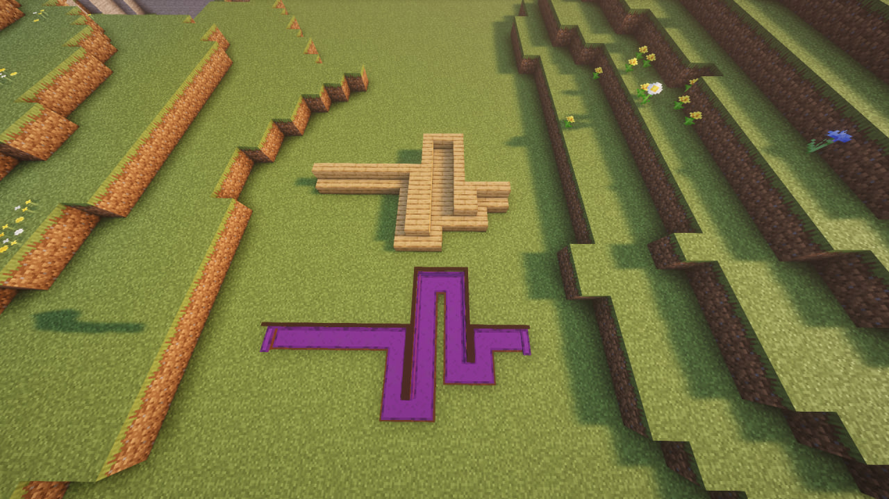
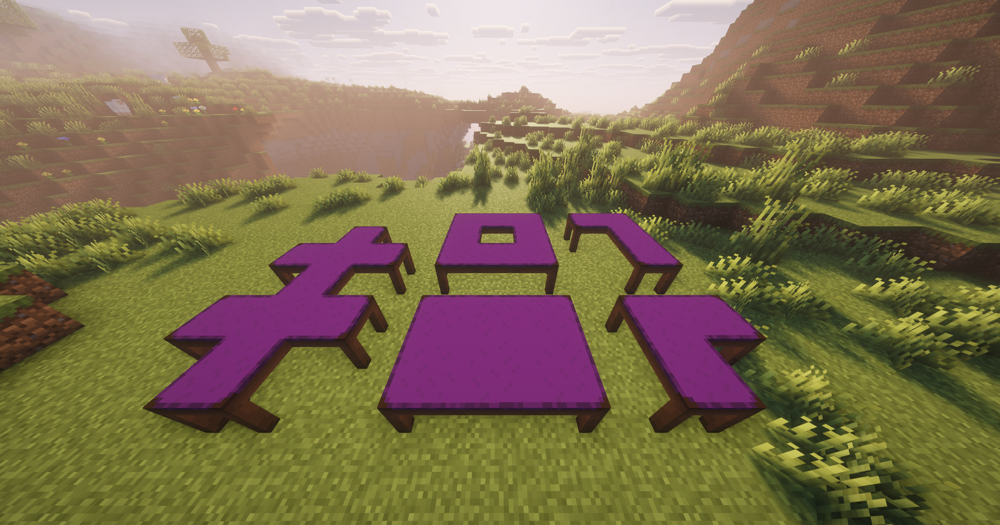

# Connectable



```yaml
connectable:
  type: stair # Optional (Default value: stair)
  default: connectable_furniture
  straight: connectable_furniture_straight
  left: connectable_furniture_left
  right: connectable_furniture_right
  outer: connectable_furniture_outer
  inner: connectable_furniture_inner
```

<figure><figcaption></figcaption></figure>



```yaml
connectable:
  type: table
  default: connectable_furniture
  straight: connectable_furniture_straight
  middle: connectable_furniture_middle
  border: connectable_furniture_border
  corner: conectable_furniture_corner
  end: connectable_furniture_end
```

<figure><figcaption></figcaption></figure>



The IDs specified must be custom furnitures.
